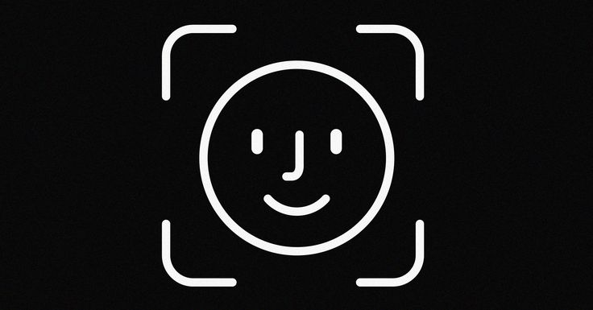

     

# OSIRIS



Bienvenue ici !
OSIRIS est un projet open-source basé sur [Opencv](https://github.com/opencv/opencv) et le language [Rust](https://www.rust-lang.org/).
Il devra principalement servir à detecter des figures geometriques ou des visages recherchés.

## - objectifs:

- [x] Face Detection
- [ ] Improve Code level
- [ ] Facial Recognition 
- [ ] Symboles Recognition
- [ ] Gesture Recognition 
- [ ] Vocal Recognition
- [ ] Add a GUI Interface 
- [ ] Join to LLM 
- [ ] Integrate To Devices (Tablets , Watchs, Phones , Computers... , Security-Cams)
- [ ] Join to a Custom [Linux](https://www.kernel.org/) Kernel (CLK). Preference for [Ubuntu](https://ubuntu.com/).

      
### ✍️ Random Dev Quote


## Installation
```bash
git clone https://github.com/ATRA2022/OSIRIS.git
cd OSIRIS
cargo build
